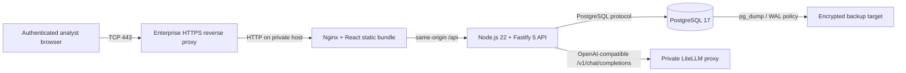
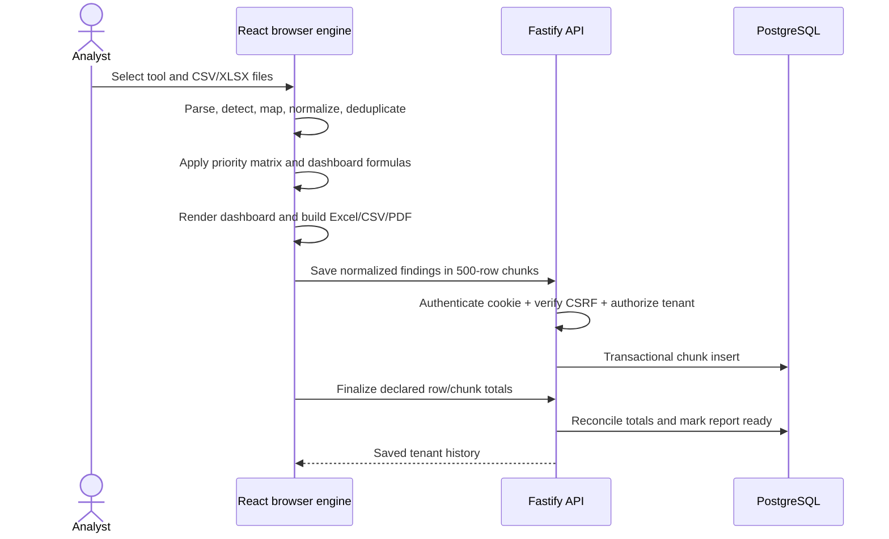
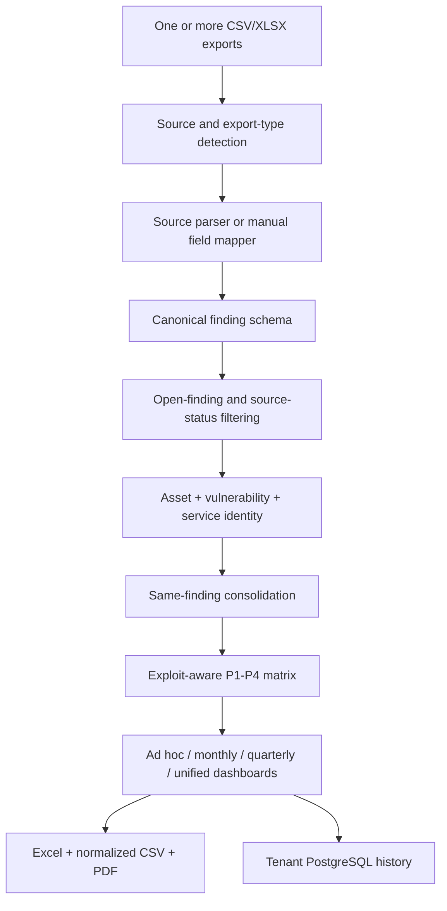
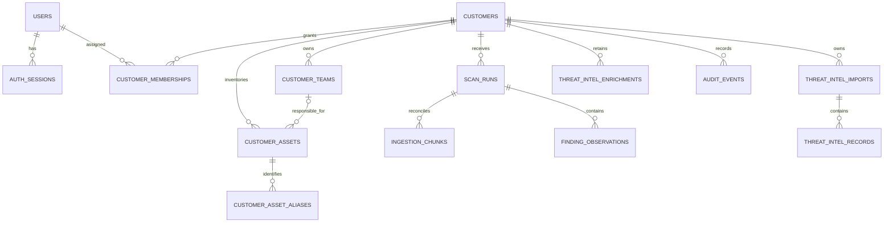
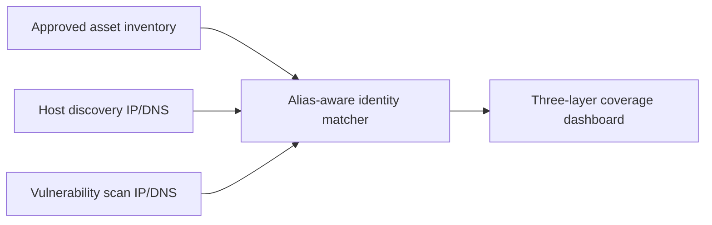
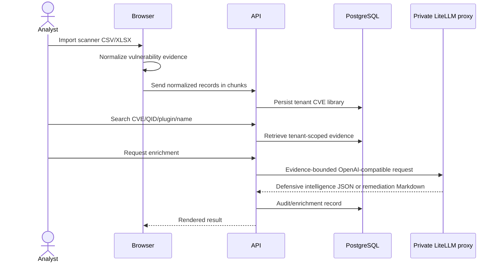

# MVA Architecture and Technology Stack

## 1. System Purpose

MVA is an internally hosted, multi-tenant vulnerability-management platform. It separates four concerns:

1. Browser-side scanner parsing and report generation.
2. API-side authentication, authorization, persistence, and audit.
3. PostgreSQL tenant data and reporting history.
4. Private model enrichment through an organization-managed LiteLLM proxy.

This separation keeps raw scanner exports out of the database while retaining normalized evidence needed for customer dashboards, history, threat intelligence, and team ownership.

## 2. Production Topology



Only the HTTPS reverse proxy is exposed to users. The API, PostgreSQL, and LiteLLM have no public listener in `compose.production.yml`.

## 3. Technology Stack

| Layer | Technology | Responsibility |
|---|---|---|
| UI | React 18 | Authentication shell, tenant navigation, uploads, dashboards, administration |
| Styling | Tailwind CSS 3 | Black/red Help AG visual system, responsive layout, state styling |
| Build | Vite 6 | Development server and optimized production bundle |
| Charts | Recharts 2 | Browser line, bar, and coverage visualizations |
| CSV | Papa Parse 5 | Header-aware CSV parsing in the browser |
| XLSX | ExcelJS 4 | XLSX input and branded customer workbook generation |
| PDF | jsPDF 4 | Deterministic Executive Dashboard and Remediation Guide rendering |
| Icons | Lucide React | Accessible interface iconography |
| API | Node.js 22 + Fastify 5 | Auth, CSRF, tenant authorization, persistence, reporting APIs |
| Database driver | `pg` 8 | Parameterized PostgreSQL access and transactions |
| Database | PostgreSQL 17 | Tenants, users, assets, observations, history, threat intel, audit |
| AI gateway | LiteLLM Proxy API | Authenticated model routing for remediation and intelligence generation |
| Edge | Nginx 1.27 | Static assets, same-origin API proxy, response security headers |
| Packaging | Docker Compose | Reproducible local and single-host production deployment |
| CI | GitHub Actions | Unit tests, builds, dependency audits, and tracked-secret scan |

Versions are pinned by `react-ui/package-lock.json`, `server/package-lock.json`, and container tags.

## 4. Browser Processing Boundary



Raw file bytes are never sent to Fastify. The browser sends normalized JSON only after analysis. The API stores source provenance and normalized evidence, not the original attachment.

## 5. Analysis Architecture



The deduplication key is not the asset alone. It includes:

```text
normalized asset identity
+ vulnerability identity (CVE preferred, source ID/name fallback)
+ protocol
+ port or product
```

Therefore, two different vulnerabilities on the same asset remain two findings. The same vulnerability observed by two scanners on the same asset/service becomes one finding with both source tools retained.

Implemented source adapters are Tenable.sc, Tenable.io, Qualys VMDR, Custom Qualys, CrowdStrike, Red Hat OpenShift, and the universal custom-field mapper. OpenShift preserves namespace, deployment, image, component, fixability, fixed version, CVSS, discovery date, and reference evidence. Because its supplied schema has no exploit field, `Fixable` never changes exploit availability or upgrades patch priority.

## 6. Multi-Tenant Data Model



Tenant enforcement is performed by authenticated API repository queries. The browser never supplies a trusted tenant header. Every tenant route verifies the current user and membership before reading or writing.

## 7. Access Model

| Role | Scope | Capabilities |
|---|---|---|
| `system_admin` | All tenants | Create/edit/delete tenants, create users, assign access, manage all assets and reports |
| `owner` | Assigned tenant | Analyze, persist, manage teams/assets, export, use local LLM |
| `analyst` | Assigned tenant | Analyze, persist, manage approved assets, export, use local LLM |
| `viewer` | Assigned tenant | Read dashboards, inventory, history, and exports |

The first-run bootstrap endpoint closes after the first administrator is created. There is no general signup flow.

## 8. Authentication and Request Security

- Passwords are salted `scrypt` hashes; plaintext passwords are never stored.
- Session tokens are 256-bit random values; only SHA-256 token hashes are stored.
- The browser receives an `HttpOnly`, `SameSite=Strict` cookie.
- Production cookies require HTTPS with `COOKIE_SECURE=true`.
- Authenticated writes require a separate `X-MVA-CSRF` token.
- CSRF comparison is constant-time.
- Login attempts are limited per IP/email pair.
- Sessions expire after eight hours.
- API responses are `no-store`, `nosniff`, frame-denied, and no-referrer.
- Nginx adds a restrictive Content Security Policy and permissions policy.
- CORS uses an exact production origin, never an unrestricted wildcard.
- The API accepts a maximum 32 MiB JSON body; normal ingestion is split into 500-row chunks.

## 9. Asset and Coverage Architecture

MVA uses three independent evidence layers:

1. **In-scope inventory**: customer-approved assets.
2. **Host discovery**: assets seen in one to five discovery reporting periods.
3. **Vulnerability scan**: assets represented in the latest saved normalized scan.



Identity matching uses exact IP, exact DNS/FQDN, host name, external ID, and unique short-DNS aliases. Ambiguous short names are reported instead of guessed.

Deleting an inventory asset removes it from active tenant posture and exports. Historic normalized observations remain for audit and prior report reconstruction.

Every coverage population can be exported as CSV: inventory, discovered, vulnerability-scanned, confirmed by both, not discovered, missing from the vulnerability result, vulnerability-result only, full discovery history, discovered, not discovered, never discovered, and exceptions.

## 10. Threat Intelligence and Private AI



There is no browser provider-key field. `LITELLM_URL`, `LITELLM_API_KEY`, `LITELLM_MODEL`, and timeout values are server environment settings. The model receives only the normalized, bounded evidence required for the requested action.

## 11. Scale and Consistency

- File parsing and normalization are linear in source rows.
- Multi-file source selection appends uploads; a same-name file replaces its earlier copy.
- Monthly grouping is by detected reporting period, not upload order.
- Findings persist in 500-row transactional chunks.
- A deterministic ingestion hash makes repeated saves idempotent per tenant.
- Finalization fails if expected rows, received rows, expected chunks, or received chunks disagree.
- PostgreSQL indexes cover tenant/report history, asset identity, period/priority/severity, CVE, datacentre, and threat-intel lookups.
- The release validation includes 80,000 observations across 160 chunks.

## 12. Repository Layout

```text
react-ui/                 React UI, parser, dashboards, browser reports
server/                   Fastify API, PostgreSQL repository, migrations
server/migrations/        Ordered idempotent database migrations
samples/                  Synthetic source, inventory, and discovery files
final/Production Evidence Validated Excel, Executive PDF, and Remediation PDF output set
ss/final-evidence/        UI and rendered report screenshots
tools/                    Seed, evidence, and PostgreSQL validation tools
docs/                     Authoritative architecture/deployment/validation
compose.local.yml         Local Docker stack
compose.production.yml    Isolated production stack
```

## 13. Official Runtime References

- React: <https://react.dev/>
- Vite: <https://vite.dev/guide/>
- Tailwind CSS: <https://v3.tailwindcss.com/docs>
- Fastify: <https://fastify.dev/docs/latest/>
- PostgreSQL 17: <https://www.postgresql.org/docs/17/>
- Docker Compose production: <https://docs.docker.com/compose/how-tos/production/>
- Docker Compose health ordering: <https://docs.docker.com/compose/how-tos/startup-order/>
- LiteLLM proxy: <https://docs.litellm.ai/>
- OWASP Application Security Verification Standard: <https://owasp.org/www-project-application-security-verification-standard/>
