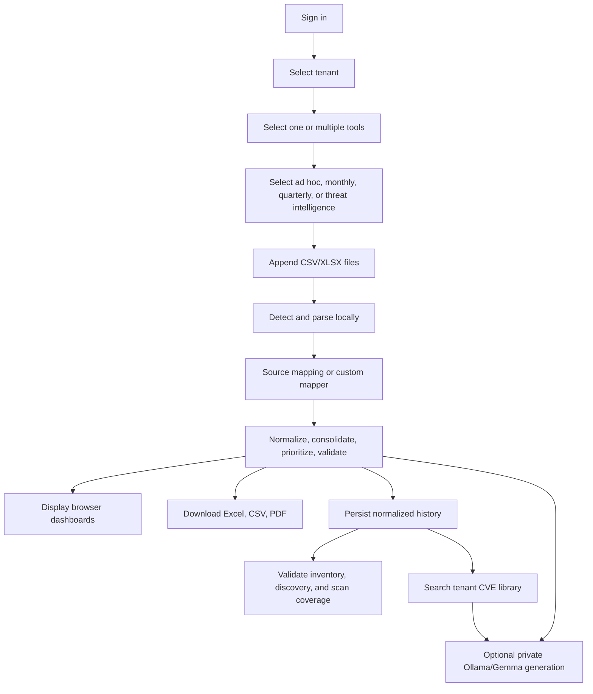

# MVA Complete Production Handover

## 1. Product Definition

**Product name:** MVA Unified Vulnerability Management Platform
**Primary UI title:** MVA Vulnerability Agent
**Purpose:** Unified reporting and remediation for tenant-isolated vulnerability programs.

MVA provides:

- system-administrator login and closed first-run bootstrap;
- tenant creation, editing, deletion, and isolation;
- tenant owner, analyst, and viewer roles;
- responsible teams and asset responsibility;
- CSV/XLSX asset onboarding and manual/pasted asset onboarding;
- Tenable.sc, Tenable.io, Qualys, Custom Qualys, CrowdStrike, Red Hat OpenShift, and Custom CSV parsing;
- ad hoc, monthly, quarterly, and selected multi-tool workflows;
- browser dashboards, branded Excel, normalized CSV, Executive Dashboard PDF, and Remediation Guide PDF;
- PostgreSQL report history and tenant security posture;
- inventory/host-discovery/vulnerability-scan coverage;
- tenant CVE library and local Ollama/Gemma enrichment;
- synthetic sample data and repeatable release evidence.

## 2. Final Product Decisions

| Decision | Final implementation |
|---|---|
| Frontend | React + Tailwind, not Streamlit |
| Backend | Node.js + Fastify |
| Database | PostgreSQL |
| Raw scanner files | Parsed in browser, not stored |
| Normalized findings | Stored in PostgreSQL after analysis |
| Local AI | Fastify to private Ollama/Gemma |
| Cloud AI keys | Removed |
| Static hosting | Not supported for production |
| Production entry | Same-origin HTTPS |
| Tenant enforcement | API session + membership checks |
| Patch priority | Fixed approved P1-P4 matrix |
| Excel scope | Customer-focused core dashboards and data |
| Browser scope | Core plus internal decision/quality dashboards |

## 3. End-to-End Workflow



## 4. Repository Map

### Root

| Path | Responsibility |
|---|---|
| `README.md` | Product entry point and local run |
| `SAMPLE_DATA.md` | Manual test paths and sequence |
| `.env.example` | Safe local configuration template |
| `.env.production.example` | Safe production configuration template |
| `compose.local.yml` | Local Docker stack |
| `compose.production.yml` | Private production stack |
| `run-postgres-native.sh` | macOS native launcher |
| `run-postgres-local.sh` | Docker local launcher |
| `samples/` | Synthetic source and asset data |
| `final/Production Evidence/` | Validated report artifacts |
| `ss/final-evidence/` | UI/report evidence |
| `tools/` | Seed, generate, inspect, and validate |

### Frontend

| Path | Responsibility |
|---|---|
| `react-ui/src/App.jsx` | Main workflow state and page composition |
| `react-ui/src/context/PlatformContext.jsx` | Session, tenant, API state |
| `react-ui/src/components/AuthScreen.jsx` | Bootstrap/sign-in UI |
| `react-ui/src/components/Sidebar.jsx` | Role-aware navigation |
| `react-ui/src/components/SourceChoice.jsx` | Single/multi-tool selection |
| `react-ui/src/components/OperationMode.jsx` | Analysis workflow selection |
| `react-ui/src/components/UploadPanel.jsx` | Ad hoc/quarterly upload and exports |
| `react-ui/src/components/MonthlyComparison.jsx` | Multi-period upload, required dashboards, selected-period exports |
| `react-ui/src/components/CustomFieldMapper.jsx` | Manual universal parser mapping |
| `react-ui/src/components/QualysInsights.jsx` | Datacentre/status/detection insights |
| `react-ui/src/components/CrowdStrikeInsights.jsx` | Exploit source/confidence/exposure insights |
| `react-ui/src/components/OpenShiftInsights.jsx` | Namespace/component/image/fixability insights |
| `react-ui/src/components/UnifiedAnalysisDashboard.jsx` | Consolidated multi-tool posture |
| `react-ui/src/components/CustomerValueDashboards.jsx` | Browser-only threat/campaign/verification/quality views |
| `react-ui/src/components/CustomerDashboard.jsx` | Saved tenant security posture |
| `react-ui/src/components/AdminConsole.jsx` | Tenant/user administration |
| `react-ui/src/components/AssetInventoryWorkspace.jsx` | Inventory CRUD and teams |
| `react-ui/src/components/HostDiscoveryCoverage.jsx` | Discovery and three-layer coverage |
| `react-ui/src/components/ThreatIntelPanel.jsx` | Tenant CVE library and enrichment |
| `react-ui/src/components/LlmConfiguration.jsx` | Read-only local model route and test |
| `react-ui/src/lib/vulnerabilityEngine.js` | Detection, parsing, normalization, identity, matrix, dashboards |
| `react-ui/src/lib/customerInsights.js` | Browser-only value dashboards |
| `react-ui/src/lib/reportExport.js` | XLSX generation and embedded charts |
| `react-ui/src/lib/pdfReport.js` | PDF prompt/fallback/rendering |
| `react-ui/src/lib/executiveReportPdf.js` | Deterministic executive dashboard PDF |
| `react-ui/src/lib/assetInventory.js` | Inventory CSV/XLSX/paste parsing |
| `react-ui/src/lib/hostDiscovery.js` | Host discovery parsing and coverage |
| `react-ui/src/lib/platformApi.js` | Authenticated API client |
| `react-ui/src/lib/databaseClient.js` | Chunked normalized report persistence |

### Backend

| Path | Responsibility |
|---|---|
| `server/src/server.js` | Environment, database, migrations, startup |
| `server/src/app.js` | Fastify routes, auth hooks, CSRF, CORS |
| `server/src/repository.js` | Parameterized PostgreSQL operations |
| `server/src/auth.js` | Password/session primitives |
| `server/src/validation.js` | Request and payload normalization |
| `server/src/localLlm.js` | Private Ollama connectivity/chat |
| `server/src/csv.js` | Tenant finding CSV stream |
| `server/migrations/*.sql` | Ordered idempotent schema |
| `server/test/*.test.js` | API, security, and local-LLM contracts |

## 5. Frontend State Model

`App.jsx` owns separate state for:

```text
selected source or selected source set
selected workflow
ad hoc files and result
monthly files and result
quarterly files and result
selected PDF/report period
current navigation page
```

File lists are arrays, not one `File` value. New drops append. If a file with the same name is added again, it replaces that file only. Each file has an individual remove action and the complete list has a clear action.

Results have a **Back to Dashboards** path and an **Edit uploads** path. Editing uploads preserves the existing file list.

## 6. Source Detection

The engine reads headers before parsing records.

Detection order:

1. Explicit custom-parser choice.
2. Tenable.io dot-notation signatures.
3. Tenable.sc plugin/IP signatures.
4. Qualys QID/Title/Vuln Status signatures.
5. CrowdStrike detailed or aggregate signatures.
6. Red Hat OpenShift exact 11-field workload signature.
7. Unsupported-source error with detected header evidence.

The selected tool is validated against the detected family. A file from an unselected source is rejected before it can contaminate a unified result.

## 7. Parser Contracts

The detailed mapping is in `FIELD_TO_DASHBOARD_MAPPING.md`.

### Qualys

- `Datacentre` is retained and grouped.
- `Type` permits the supplied `VUL` value.
- `Times Detected` is historic detection evidence.
- `Vendor Reference` enters KB/reference output.
- Threat/Impact headers are case-insensitive.
- `Exploitability` uses non-empty evidence presence.
- `Vuln Status` excludes closed lifecycle states and categorizes open states.
- Standard and custom severity profiles are separate source selections.

### CrowdStrike

- `Exploit status label` is authoritative when present.
- `Exploit status value` is the first fallback.
- `ExPRT Rating` is the second fallback.
- explicit negative values override generic positive-token matches;
- `Vulnerability Confidence` is retained independently;
- internet exposure is shown only when the scanner supplied the field;
- aggregate remediation rows use `Count` as weight.

### Red Hat OpenShift

- requires `Namespace`, `Deployment`, `Image`, `Component`, `CVE`, `Fixable`, `CVE Fixed In`, `Severity`, `CVSS`, `Discovered At`, and `Reference`;
- workload identity is namespace plus deployment, with image retained in the consolidation key;
- `Fixable` and `CVE Fixed In` create remediation guidance and fix-coverage dashboards;
- fix availability never implies exploit availability;
- the supplied schema has no exploit field, so Critical/High remain P2 unless a future approved parser maps explicit exploit evidence;
- PostgreSQL migration `011` retains workload, fix, and CVSS evidence.

### Custom

The user maps common fields. Required mapping validation happens before analysis. Custom severity and exploit interpretation are explicit inputs to the parser, not heuristics hidden after upload.

## 8. Normalization and Identity

All source parsers return the same object shape. The key requirement is accurate identity.

Asset preference:

```text
IP -> DNS/FQDN -> host ID/name
```

Vulnerability preference:

```text
CVE -> source vulnerability ID -> normalized vulnerability name
```

Service identity:

```text
protocol + port
product fallback when no port is available
```

This prevents the prior incorrect behavior of deduplicating all findings on one asset.

## 9. Multi-Tool Logic

The user chooses which physical scanner families participate. **Select all** does not select the alternate Custom Qualys rating profile together with standard Qualys.

Same-period files are first normalized independently, then consolidated by finding identity. The merged row retains:

- all source tools;
- highest severity;
- positive exploit evidence when any source provides it;
- earliest first-discovered;
- latest last-observed;
- strongest available text/reference fields;
- final recalculated P1-P4 priority.

Cross-tool confirmation means the same normalized asset/vulnerability/service was observed by at least two selected scanner families. It is evidence depth, not an accuracy percentage.

## 10. Dashboard Engine

### Ad hoc

`buildAdhocDashboard()` calculates:

- total weighted open;
- severity;
- P1-P4;
- exploit available;
- immediate patch P1 + P2;
- distinct affected assets;
- top 10 affected assets;
- scanner-specific insight;
- unified insight when multiple tools are selected;
- data quality and campaign views.

### Monthly

`buildComparisonDashboard()`:

1. extracts a deterministic period from each filename/source;
2. groups files from the same period;
3. sorts periods;
4. creates one finding map per period;
5. compares weighted keys;
6. builds the exact five required dashboards;
7. validates all arithmetic identities;
8. returns only a valid result.

### Quarterly

The current implementation analyzes one current scanner result and derives the latest three months from first-discovered dates. It does not pretend to have quarter-over-quarter closure history.

## 11. Priority and Exposure

P1-P4 is exclusively severity plus exploit availability. See the matrix in `FIELD_TO_DASHBOARD_MAPPING.md`.

Asset Exposure is a separate 0-1000 sorting value:

1. use a supplied VPR/CVSS-equivalent score when mapped;
2. scale a 0-10 score to 0-1000;
3. otherwise use severity baseline plus exploit evidence;
4. clamp to 0-1000.

CrowdStrike can add supplied asset criticality/internet exposure context to this separate exposure score. It does not alter P1-P4.

## 12. Reporting

### Excel

ExcelJS creates:

- Help AG branded cover and contents;
- executive dashboard;
- workflow dashboard sheet;
- unified dashboard only for multi-tool;
- executive briefing;
- top vulnerable assets and top vulnerabilities;
- `Report Data`;
- `Source Audit`.

Charts are rendered as PNG from deterministic SVG and embedded into the workbook. This avoids Excel repair prompts and preserves line charts across desktop spreadsheet viewers.

The workbook:

- freezes headers;
- uses compact column widths;
- color-codes severity/P1-P4;
- has no merged dashboard headers that break filtering;
- includes no obsolete `Lane` field;
- reopens through ExcelJS validation;
- is inspected for formula errors.

### Normalized CSV

The same customer finding fields are flattened to UTF-8 CSV. It is available for ad hoc, monthly, quarterly, and tenant-filtered exports.

### PDF

The model/fallback produces Markdown in the contract from `AI_PDF_GENERATION_PROMPT.md`. jsPDF renders:

- Remediation Guide title;
- contents;
- report type and selected tool source;
- selected period;
- vulnerability actions;
- affected assets;
- clean code blocks;
- validation;
- references;
- headers, footers, and page numbers.

The deterministic fallback remains available when Ollama is unavailable.

The separate deterministic Executive Dashboard PDF does not use an LLM. It renders the selected period's executive summary, discovered and remediated lines, open reconciliation, P1-P4 posture, age matrix, top assets, top vulnerabilities, and methodology.

## 13. Asset Inventory

Inventory inputs:

```text
Tool
Asset Type
IP Address
DNS Name
Host Name
Team Name
OS Name
```

The parser also recognizes common aliases. Only one identity is required; all supplied identities become aliases.

Users can:

- upload CSV/XLSX by browse or drag/drop;
- paste rows;
- type/create responsible team;
- type/select asset type;
- assign onboarding tool;
- edit individual assets;
- search;
- select one or many;
- delete one or many.

Deletion updates active dashboard scope and exports. Historic scanner observations remain retained.

## 14. Host Discovery

Discovery files require only IP and/or DNS. One to five reporting periods are accepted. The engine:

- excludes explicit offline/unreachable rows;
- removes duplicate host rows;
- matches exact inventory aliases;
- reports ambiguous identities instead of choosing;
- reports unmatched identities;
- calculates coverage, new coverage, lost coverage, never seen, and consistently seen;
- exports per-asset history and exceptions.

The three-layer view combines:

```text
inventory
host discovery
latest vulnerability scan
```

## 15. Tenant Security Posture

The API dashboard uses the latest ready report. It compares against the previous period inside the same saved multi-period run when available; otherwise it finds the prior compatible saved report.

Metrics:

- open;
- new;
- fixed/no longer observed;
- repeated;
- affected assets;
- P1 + P2;
- exploit available;
- excluded by inventory scope;
- severity;
- P1-P4;
- age;
- source;
- responsible team;
- top assets;
- inventory coverage.

Deleting inventory assets removes those identities from current active posture. It does not destroy historic evidence.

## 16. Threat Intelligence

The threat-intelligence import reuses the scanner parser or custom mapping. Normalized records are persisted in tenant-scoped chunks and searchable by:

```text
CVE
vulnerability name
QID
plugin/source ID
```

Stored records include IP/DNS so affected assets are visible.

Local enrichment:

1. API retrieves matching tenant records.
2. API builds an evidence-bounded defensive prompt.
3. Fastify calls private Ollama `/api/chat`.
4. The response is returned and audited.
5. No provider key exists in the browser.

## 17. API Design

Route groups:

```text
/health
/api/v1/auth/*
/api/v1/customers/*
/api/v1/admin/users
/api/v1/customers/:id/assets
/api/v1/customers/:id/teams
/api/v1/customers/:id/scan-runs
/api/v1/customers/:id/threat-intel
/api/v1/customers/:id/llm
/api/v1/customers/:id/ai/remediation
```

Every write:

1. authenticates the session cookie;
2. checks the database session expiry;
3. constant-time checks `X-MVA-CSRF`;
4. checks system role or tenant membership;
5. validates and normalizes input;
6. executes parameterized SQL in the tenant scope;
7. records audit evidence where applicable.

## 18. PostgreSQL Schema

Migration sequence:

| Migration | Adds |
|---|---|
| `001_initial.sql` | Scan runs, chunks, normalized observations |
| `002_multitenant.sql` | Tenants, users, sessions, memberships, assets, aliases, audit |
| `003_asset_scope_performance.sql` | Active-scope indexes |
| `004_asset_categories.sql` | Asset type/platform categories |
| `005_membership_asset_scope.sql` | Membership asset-type scope |
| `006_customer_teams.sql` | Responsible teams and asset assignment |
| `007_repair_report_period_dates.sql` | Period-date correction |
| `008_asset_onboarding_tool.sql` | Scanner/tool onboarding field |
| `009_scanner_evidence_and_threat_intel.sql` | Qualys/CrowdStrike evidence and CVE library |
| `010_threat_intel_asset_identity.sql` | Threat-intel IP/DNS |
| `011_openshift_workload_evidence.sql` | OpenShift namespace, deployment, image, component, fixability, fixed version, and CVSS evidence |

Migrations are applied in filename order and are written to be safely repeatable.

## 19. Persistence Protocol

Browser:

1. builds normalized findings;
2. computes deterministic ingestion key;
3. creates a scan run declaring expected rows/chunks;
4. sends 500-row chunks;
5. finalizes.

API:

1. enforces one ingestion key per tenant;
2. makes repeat saves idempotent;
3. inserts each chunk and marker transactionally;
4. checks row indexes and expected totals;
5. refuses incomplete finalization;
6. marks ready only after exact reconciliation.

This protocol was tested with 80,000 observations and 160 chunks.

## 20. Authentication Implementation

The initial administrator uses an advisory-lock-protected bootstrap. After one user exists, the endpoint rejects additional bootstrap attempts.

Password storage:

```text
scrypt
N = 32768
r = 8
p = 3
random salt per password
```

Session storage:

```text
random 256-bit browser token
SHA-256 token hash in PostgreSQL
separate CSRF token
8-hour expiration
HttpOnly + SameSite=Strict cookie
Secure in production
```

## 21. UI and Branding

Visual direction:

- near-black neutral background;
- Help AG red as controlled emphasis;
- white primary type and muted slate secondary type;
- compact enterprise typography;
- subtle borders, not excessive glow;
- consistent severity/P1-P4 colors;
- official Help AG logo at `react-ui/public/brand/helpag-logo-white.png`;
- custom MVA shield/mark rendered by the UI;
- responsive desktop and mobile layout.

The app title remains **MVA Vulnerability Agent**. The product descriptor is **Unified reporting and remediation**.

## 22. Rebuild from an Empty Repository

### Step 1: Scaffold

```bash
mkdir unified-tool
cd unified-v2
npm create vite@latest react-ui -- --template react
mkdir -p server/src server/migrations server/test docs samples tools
```

### Step 2: Frontend dependencies

```bash
cd react-ui
npm install react react-dom recharts lucide-react papaparse exceljs jspdf
npm install --save-dev vite @vitejs/plugin-react tailwindcss postcss autoprefixer @resvg/resvg-js
npx tailwindcss init -p
```

### Step 3: API dependencies

```bash
cd ../server
npm init -y
npm install fastify @fastify/cookie @fastify/cors pg
```

Set `"type": "module"` and add start/test scripts.

### Step 4: Build database first

Create ordered migrations for tenants, users, sessions, memberships, assets, aliases, teams, scan runs, chunks, findings, threat-intelligence records, and audit events. Add tenant and identity indexes before loading large data.

### Step 5: Build security primitives

Implement:

- scrypt password hash/verify;
- opaque session token generation/hash;
- CSRF token;
- first-user bootstrap lock;
- role and membership checks;
- exact CORS allowlist;
- secure cookie configuration;
- login rate limiting.

Test these before building administration.

### Step 6: Build the canonical finding engine

Create:

- source-header detector;
- one normalizer per source;
- custom field mapper;
- common finding schema;
- open-status filter;
- finding key;
- multi-tool merger;
- P1-P4 function;
- exposure function;
- ad hoc and comparison dashboards;
- invariant validator.

Write parser fixtures before UI integration.

### Step 7: Build React workflows

Order:

1. authentication and tenant context;
2. sidebar;
3. source selection;
4. operation selection;
5. append/remove upload list;
6. custom mapper;
7. dashboards;
8. reports;
9. persistence;
10. administration;
11. inventory;
12. discovery coverage;
13. threat intelligence;
14. local LLM configuration.

### Step 8: Add reports

Use the same normalized findings for browser, Excel, CSV, PDF, and persistence. Do not maintain separate calculation engines for each output.

### Step 9: Add Docker

Create:

- Node API image running unprivileged;
- Vite build stage and Nginx runtime;
- PostgreSQL service;
- health checks and `service_healthy`;
- same-origin API proxy;
- mounted PostgreSQL secret;
- internal-only API/database;
- HTTPS reverse proxy outside the Compose stack.

### Step 10: Add samples and validation

Generate deterministic samples covering:

- positive/negative exploit evidence;
- all severities and priorities;
- closed status filtering;
- reappeared findings;
- new/fixed/repeated movement;
- age thresholds;
- multiple scanners on same finding;
- different vulnerabilities on same asset;
- aliases and discovery gaps;
- 80,000-row persistence.

## 23. Adding a New Scanner

Example future MDVM work:

1. Collect real raw headers for ad hoc and historical exports.
2. Add source metadata in `dashboardData.js`.
3. Add header signature and source family.
4. Add `normalizeMdvm(row)`.
5. Define exploit evidence explicitly.
6. Define open/closed status behavior.
7. Map dates, age, remediation, references, product, IP/DNS, and IDs.
8. Add sample generation with at least four periods.
9. Add parser unit tests.
10. Add monthly arithmetic tests.
11. Add Excel/PDF evidence generation.
12. Add field mapping documentation.
13. Enable the source tile only after all tests pass.

Do not infer exploit availability from severity. Do not accept a source as implemented only because its tile exists.

## 24. Validation Strategy

Validation layers:

| Layer | Evidence |
|---|---|
| Unit | Frontend parser/report and API/security tests |
| Contract | Source mappings, matrix, statuses, custom mapper |
| Arithmetic | Dashboard invariants and manual pivots |
| Persistence | Chunk reconciliation and idempotency |
| Scale | 80,000 observation integration |
| Security | session, CSRF, roles, tenant isolation, secret scan |
| Asset lifecycle | import, edit, single delete, bulk delete, dashboard sync |
| Threat intel | import, search, asset identity, local model graceful failure |
| Artifact | XLSX reopen/formula/chart checks and PDF structure |
| Visual | Browser and rendered report screenshots |

See `VALIDATION_EVIDENCE.md` and `PLATFORM_SECURITY_VALIDATION_REPORT.md`.

## 25. Known Environment Dependency

The local LLM connection test and AI-generated content require:

```text
reachable Ollama
installed configured model
adequate model hardware
approved internal firewall path
```

When Ollama is unavailable, the app returns a controlled error and still supports deterministic local PDF generation. This is not a parser, dashboard, database, Excel, or template-PDF failure.

## 26. Production Ownership Checklist

Before customer use, assign owners for:

- server and container patching;
- PostgreSQL backup/restore;
- TLS certificates;
- user and tenant administration;
- model hosting and approval;
- scanner field-change regression testing;
- incident response and audit review;
- capacity monitoring;
- report/matrix change control.

## 27. Authoritative Files

If documents conflict, use this order:

1. Current source and automated tests.
2. `FIELD_TO_DASHBOARD_MAPPING.md`.
3. `DEPLOYMENT_RUNBOOK.md`.
4. `ARCHITECTURE_AND_STACK.md`.
5. This handover.

Older cloud-key, NVIDIA, static GitHub Pages, and duplicate handover documents were intentionally removed from the clean release.
