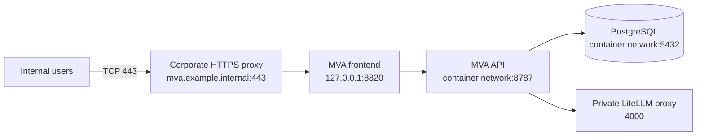

# MVA Internal Production Deployment Runbook

This runbook deploys MVA on one internal Linux server with Docker Compose, PostgreSQL, HTTPS, and an organization-controlled LiteLLM proxy. Run the commands in order.

## 1. Target Architecture



Do not expose PostgreSQL, Fastify, or LiteLLM to user networks.

## 2. Firewall Matrix

| Source | Destination | Port | Direction | Required | Purpose |
|---|---|---:|---|---:|---|
| Approved user networks | MVA reverse proxy | TCP 443 | Inbound to MVA | Yes | Web platform |
| MVA host | Internal DNS | UDP/TCP 53 | Outbound | Yes | Name resolution |
| MVA host | Internal NTP | UDP 123 | Outbound | Yes | Time consistency |
| MVA API container/host | PostgreSQL container | TCP 5432 | Internal only | Yes | Platform data |
| MVA API container/host | LiteLLM host | TCP 4000 or approved TLS port | Outbound/private | For AI | Model discovery, remediation, and intelligence |
| Admin jump host | MVA host | TCP 22 | Inbound | Optional | Managed administration |
| MVA host | Approved update mirrors | TCP 443 | Outbound | Optional | OS/container updates |

Local development ports `55432`, `8787`, and `8820` must not be opened in the production firewall.

## 3. Prerequisites

Recommended baseline:

- 64-bit Linux server.
- 8 vCPU and 16 GiB RAM for the platform, excluding the model.
- 100 GiB encrypted storage for the platform and database.
- A reachable LiteLLM proxy with the approved model alias and an MVA-scoped virtual key.
- Docker Engine and Docker Compose v2.
- Internal DNS name and organization-issued TLS certificate.
- Backup destination with restricted access.

Verify:

```bash
docker --version
docker compose version
git --version
openssl version
```

## 4. Create the Service Account and Directory

Run as a privileged administrator:

```bash
sudo useradd --system --create-home --shell /bin/bash mva
sudo mkdir -p /opt/mva
sudo chown mva:mva /opt/mva
```

Switch to the service account:

```bash
sudo -iu mva
cd /opt/mva
```

## 5. Clone the Public Source Repository

```bash
git clone https://github.com/DrHayabusa/unified-v2.git
cd unified-v2
git checkout main
git pull --ff-only origin main
```

Record the deployed commit:

```bash
git rev-parse HEAD
```

## 6. Create Private Configuration

```bash
cp .env.production.example .env.production
mkdir -p .secrets
umask 077
openssl rand -hex 32 > .secrets/postgres_password
chmod 600 .secrets/postgres_password .env.production
```

Edit `.env.production`:

```bash
nano .env.production
```

Required values:

```dotenv
MVA_POSTGRES_PASSWORD_FILE=./.secrets/postgres_password
MVA_PUBLIC_ORIGIN=https://mva.example.internal
MVA_LISTEN_ADDRESS=127.0.0.1
MVA_FRONTEND_PORT=8820
LITELLM_URL=http://host.docker.internal:4000
LITELLM_API_KEY=REPLACE_WITH_MVA_VIRTUAL_KEY
LITELLM_MODEL=organization-model-alias
LITELLM_CONNECT_TIMEOUT_MS=10000
LITELLM_READ_TIMEOUT_MS=600000
COOKIE_SECURE=true
TRUST_PROXY=2
```

Use the actual internal HTTPS hostname. `TRUST_PROXY=2` represents the external TLS proxy plus the frontend Nginx proxy. If your topology differs, document and test the trusted-hop value.

The database password is mounted from `.secrets/postgres_password` into only PostgreSQL and Fastify. The LiteLLM virtual key is injected only into Fastify. Neither value is committed or exposed to the frontend.

## 7. Validate LiteLLM

Set `LITELLM_URL` to the proxy address reachable from the Fastify container. The URL must not include `/v1`.

Load the private deployment environment:

```bash
set -a
source .env.production
set +a
```

Verify authentication and model discovery from the MVA host:

```bash
curl --fail --silent \
  -H "Authorization: Bearer ${LITELLM_API_KEY}" \
  "${LITELLM_URL}/v1/models"
```

Confirm that `LITELLM_MODEL` appears exactly in a `data[].id` value. The in-app connectivity test performs this same check.

Validate an actual completion before starting MVA:

```bash
curl --fail --silent \
  -H "Authorization: Bearer ${LITELLM_API_KEY}" \
  -H "Content-Type: application/json" \
  -d "{\"model\":\"${LITELLM_MODEL}\",\"messages\":[{\"role\":\"user\",\"content\":\"Reply with ready\"}],\"max_tokens\":16}" \
  "${LITELLM_URL}/v1/chat/completions"
```

Restrict the proxy listener so only approved application hosts can reach it. The LiteLLM virtual key should be scoped and rotated according to the organization secret-management policy.

## 8. Validate the Compose Definition

```bash
docker compose \
  --env-file .env.production \
  -f compose.production.yml \
  config --quiet
```

Review images and private bindings:

```bash
docker compose \
  --env-file .env.production \
  -f compose.production.yml \
  config
```

Expected:

- only frontend port `127.0.0.1:8820` is host-bound;
- API and PostgreSQL have no host `ports`;
- database password is a mounted secret;
- frontend uses same-origin API routing.

## 9. Build and Start

```bash
docker compose \
  --env-file .env.production \
  -f compose.production.yml \
  up -d --build
```

Watch startup:

```bash
docker compose \
  --env-file .env.production \
  -f compose.production.yml \
  ps
```

```bash
docker compose \
  --env-file .env.production \
  -f compose.production.yml \
  logs --tail=100 postgres api frontend
```

Local health checks:

```bash
curl --fail --silent http://127.0.0.1:8820/ >/dev/null
curl --fail --silent http://127.0.0.1:8820/health
```

Expected health response includes:

```json
{"ok":true,"service":"mva-postgres-api","database":"mva"}
```

## 10. Configure the HTTPS Reverse Proxy

Example host Nginx site:

```nginx
server {
    listen 80;
    server_name mva.example.internal;
    return 301 https://$host$request_uri;
}

server {
    listen 443 ssl http2;
    server_name mva.example.internal;

    ssl_certificate /etc/pki/tls/certs/mva-fullchain.pem;
    ssl_certificate_key /etc/pki/tls/private/mva-key.pem;
    ssl_protocols TLSv1.2 TLSv1.3;

    client_max_body_size 35m;

    location / {
        proxy_pass http://127.0.0.1:8820;
        proxy_http_version 1.1;
        proxy_set_header Host $host;
        proxy_set_header X-Real-IP $remote_addr;
        proxy_set_header X-Forwarded-For $proxy_add_x_forwarded_for;
        proxy_set_header X-Forwarded-Proto https;
        proxy_read_timeout 720s;
        proxy_send_timeout 720s;
    }
}
```

Validate and reload:

```bash
sudo nginx -t
sudo systemctl reload nginx
```

Test:

```bash
curl --fail --silent https://mva.example.internal/ >/dev/null
curl --fail --silent https://mva.example.internal/health
```

Verify security headers:

```bash
curl --silent --head https://mva.example.internal/ | \
  grep -Ei 'content-security-policy|x-content-type-options|x-frame-options|referrer-policy|permissions-policy'
```

## 11. Create the First Administrator

Open:

```text
https://mva.example.internal/
```

The first-run screen permits exactly one platform administrator bootstrap. Use an organization-managed account and strong unique password. After bootstrap, the public setup path closes.

Verify:

1. Sign out.
2. Confirm the page shows **Sign in**, not administrator creation.
3. Sign in again.
4. Open **Administration**.
5. Create a test tenant and a viewer user.
6. Confirm the viewer cannot access administrative write actions.

## 12. Configure Tenants

For each tenant:

1. Create the tenant name and stable slug.
2. Select inventory-only scope for customer-approved asset boundaries.
3. Create responsible teams.
4. Import CSV/XLSX asset inventory or paste IP/DNS rows.
5. Assign tool, asset type, team, and OS/platform.
6. Validate the imported count.
7. Upload one scanner export and confirm scan-to-inventory matching.
8. Upload one to five host-discovery files and confirm three-layer coverage.
9. Create owner, analyst, or viewer memberships as required.

Do not load the synthetic `sample_1` to `sample_4` tenants into a production customer database.

## 13. Validate the Local Model Route

In MVA:

1. Sign in as system administrator, owner, or analyst.
2. Select a tenant.
3. Open **LLM configuration**.
4. Click **Test model route**.
5. Confirm the configured model alias is available and reachable.

If the result is unavailable:

```bash
docker compose \
  --env-file .env.production \
  -f compose.production.yml \
  logs --tail=100 api
```

```bash
docker compose \
  --env-file .env.production \
  -f compose.production.yml \
  exec api node -e "fetch(process.env.LITELLM_URL + '/v1/models',{headers:{Authorization:'Bearer '+process.env.LITELLM_API_KEY}}).then(r=>r.text()).then(console.log)"
```

## 14. Production Acceptance Test

Use synthetic data only:

1. Create a non-customer validation tenant.
2. Import its approved inventory.
3. Upload an ad hoc source file.
4. Confirm total open, P1-P4, top assets, and source-specific insights.
5. Download Excel, normalized CSV, and template PDF.
6. Upload four monthly files one at a time.
7. Remove and re-add one file.
8. Confirm discovered and remediated line charts.
9. Confirm total open = new + not closed.
10. Confirm P1 + P2 + P3 + P4 = total open.
11. Confirm patched = previous + new - current.
12. Download the monthly Excel and selected-month PDF.
13. Import threat-intelligence evidence and search a known CVE.
14. Generate one local-LLM remediation guide when the approved model is available.
15. Delete one inventory asset, then multiple assets, and confirm active posture updates.
16. Confirm another tenant cannot read the validation tenant.
17. Delete the validation tenant.

## 15. Database Backup

Create a restricted backup directory:

```bash
sudo mkdir -p /var/backups/mva
sudo chown mva:mva /var/backups/mva
sudo chmod 700 /var/backups/mva
```

Create a custom-format logical backup:

```bash
cd /opt/mva/unified-v2
docker compose \
  --env-file .env.production \
  -f compose.production.yml \
  exec -T postgres \
  pg_dump -U mva -d mva -Fc > "/var/backups/mva/mva-$(date -u +%Y%m%dT%H%M%SZ).dump"
```

Verify the archive:

```bash
pg_restore --list /var/backups/mva/mva-YYYYMMDDTHHMMSSZ.dump >/dev/null
```

Encrypt and replicate backups according to organizational retention policy. Test restore on a separate non-production instance at least quarterly.

Official PostgreSQL backup guidance:

<https://www.postgresql.org/docs/17/backup-dump.html>

## 16. Restore Test

Stop application writes:

```bash
docker compose \
  --env-file .env.production \
  -f compose.production.yml \
  stop frontend api
```

Restore only into an approved empty recovery database/container. Do not run an unverified restore over production. PostgreSQL warns that restores execute content from the archive; trust and inspect the backup source.

Example recovery command:

```bash
pg_restore --list /var/backups/mva/mva-YYYYMMDDTHHMMSSZ.dump
```

Follow the organization database recovery procedure and record RTO/RPO evidence.

## 17. Upgrade

Back up first, then:

```bash
cd /opt/mva/unified-v2
git fetch origin
git log --oneline HEAD..origin/main
git pull --ff-only origin main
```

Run validation:

```bash
npm ci --prefix react-ui
npm test --prefix react-ui
npm run build --prefix react-ui
npm ci --prefix server
npm test --prefix server
```

Deploy:

```bash
docker compose \
  --env-file .env.production \
  -f compose.production.yml \
  up -d --build
```

Migrations are ordered and idempotent. Fastify applies them before listening.

## 18. Rollback

Before deployment, record:

```bash
git rev-parse HEAD
```

If an application rollback is approved:

```bash
git switch --detach <previous-verified-commit>
docker compose \
  --env-file .env.production \
  -f compose.production.yml \
  up -d --build
```

Do not roll back the database blindly. Review migration compatibility and restore from a verified backup only through the database recovery process.

## 19. Operational Checks

Daily:

```bash
docker compose --env-file .env.production -f compose.production.yml ps
curl --fail --silent https://mva.example.internal/health
```

Weekly:

```bash
docker compose --env-file .env.production -f compose.production.yml logs --since=168h api | grep -Ei 'error|fatal|unauthorized'
```

Monthly:

```bash
npm audit --prefix react-ui --audit-level=moderate
npm audit --prefix server --audit-level=moderate
```

Also review disabled users, tenant memberships, backup success, storage growth, TLS expiry, model availability, and audit events.

## 20. Production Rules

- Never commit `.env`, `.env.production`, `.secrets/`, database dumps, or customer exports.
- Never hard-code a cloud or local model credential in React.
- Never expose PostgreSQL or LiteLLM directly to users.
- Never use GitHub Pages as the production MVA application.
- Never use synthetic sample credentials in production.
- Never claim a finding is fixed only because it disappeared from one scan.
- Never change the P1-P4 matrix without versioned customer approval and regression tests.

## 21. Official References

- Docker Compose production: <https://docs.docker.com/compose/how-tos/production/>
- Docker Compose secrets: <https://docs.docker.com/compose/how-tos/use-secrets/>
- Docker health-based startup: <https://docs.docker.com/compose/how-tos/startup-order/>
- PostgreSQL backup and restore: <https://www.postgresql.org/docs/17/backup.html>
- LiteLLM proxy: <https://docs.litellm.ai/>
- OWASP Password Storage: <https://cheatsheetseries.owasp.org/cheatsheets/Password_Storage_Cheat_Sheet.html>
- OWASP Session Management: <https://cheatsheetseries.owasp.org/cheatsheets/Session_Management_Cheat_Sheet.html>
