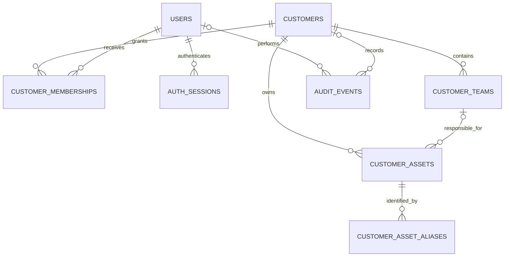
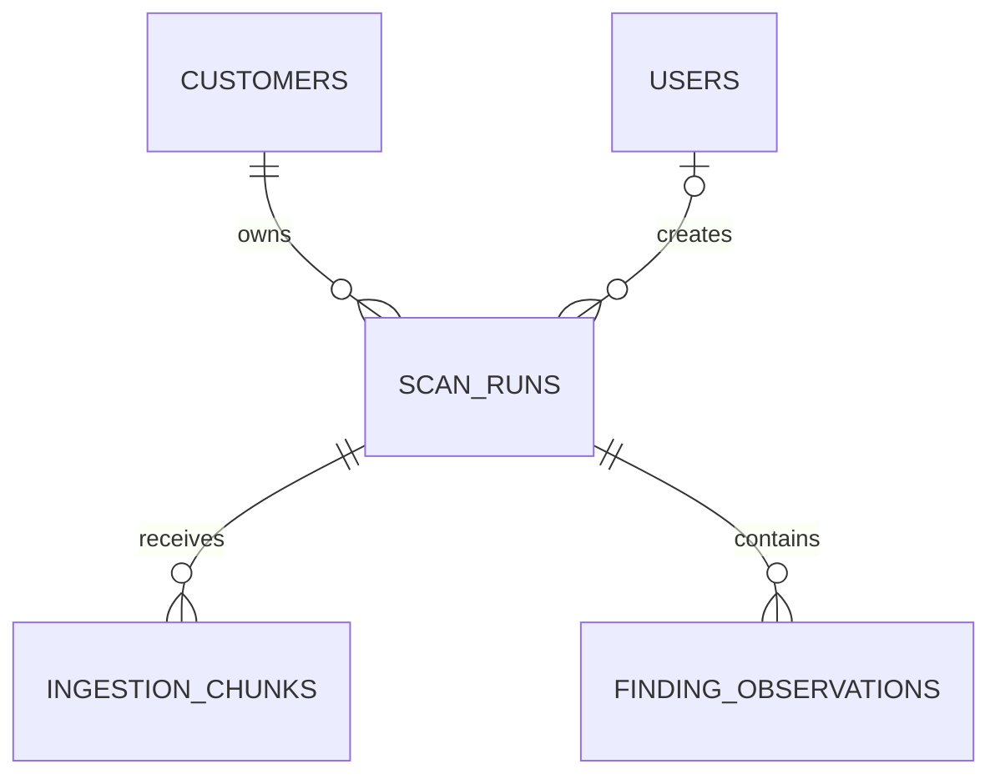
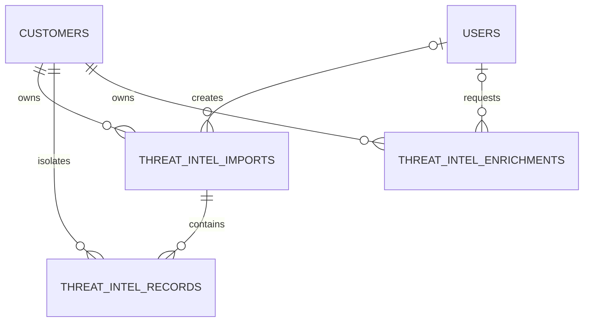
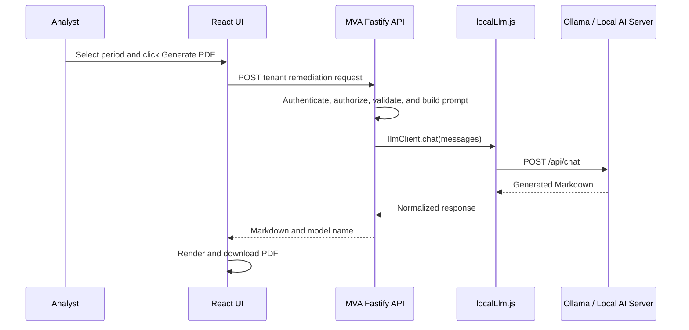

# MVA Unified Vulnerability Management Platform

## Database Schema and AI Integration Overview

**Database:** PostgreSQL 17
**Application API:** Node.js with Fastify
**Schema source:** `server/migrations/001_initial.sql` through `011_openshift_workload_evidence.sql`
**Document purpose:** Email-ready technical overview for architecture, infrastructure, database, and AI-platform teams.

## 1. Architecture Summary

The MVA platform is a multi-tenant vulnerability-management system. Every customer-owned operational record is associated with a `customer_id`. Authentication, tenant membership, asset responsibility, scan ingestion, normalized findings, threat-intelligence evidence, and audit events are stored in PostgreSQL.

Raw scanner files are parsed and normalized before findings are persisted. Large analyses are uploaded in idempotent chunks. AI requests do not originate from the browser directly: the React application calls the authenticated MVA API, and the API uses one centralized local-model adapter.

## 2. Tenant, Identity, and Asset Relationships

## 3. Scan and Finding Relationships

## 4. Threat-Intelligence Relationships

## 5. Table Directory

| Table | Purpose | Primary key | Principal relationships |
|---|---|---|---|
| `customers` | Tenant/customer master | `id` | Parent of memberships, teams, assets, scans, threat intelligence, and audit events |
| `users` | Platform user identity | `id` | Parent of sessions and optional creator/actor references |
| `customer_memberships` | Tenant authorization and role | `(customer_id, user_id)` | References `customers` and `users` |
| `auth_sessions` | Server-side login session | `id` | References `users` |
| `customer_teams` | Responsible technical teams | `id` | References `customers` |
| `customer_assets` | In-scope and scanner-observed assets | `id` | References `customers` and optional `customer_teams` |
| `customer_asset_aliases` | Alternate asset identities | `(customer_id, alias)` | References `customers` and `customer_assets` |
| `scan_runs` | Adhoc, monthly, or quarterly analysis | `id` | References `customers` and optional creator `users` |
| `ingestion_chunks` | Chunked-upload progress | `(scan_run_id, chunk_index)` | References `scan_runs` |
| `finding_observations` | Normalized vulnerability observations | `(scan_run_id, row_index)` | References `scan_runs` |
| `threat_intel_imports` | Scanner evidence import session | `id` | References `customers` and optional creator `users` |
| `threat_intel_records` | Searchable vulnerability evidence | `(import_id, row_index)` | References import and customer |
| `threat_intel_enrichments` | Local-LLM enrichment history | `id` | References customer and optional creator |
| `audit_events` | Security and administrative audit log | `id` | Optional references to user and customer |

## 6. Detailed Table Schema

### `customers`

| Column | Type | Rules |
|---|---|---|
| `id` | `uuid` | Primary key, generated |
| `name` | `text` | Required |
| `slug` | `text` | Required, unique |
| `status` | `text` | `active` or `inactive` |
| `asset_scope_mode` | `text` | `observed` or `inventory` |
| `notes` | `text` | Defaults to empty |
| `created_at`, `updated_at` | `timestamptz` | Server timestamps |

### `users`

| Column | Type | Rules |
|---|---|---|
| `id` | `uuid` | Primary key, generated |
| `email` | `text` | Required, unique |
| `full_name` | `text` | Required |
| `password_hash` | `text` | Required; password is never stored directly |
| `global_role` | `text` | `system_admin` or `customer_user` |
| `status` | `text` | `active` or `disabled` |
| `created_at`, `updated_at`, `last_login_at` | `timestamptz` | Account timestamps |

### `customer_memberships`

| Column | Type | Rules |
|---|---|---|
| `customer_id` | `uuid` | Primary key part; FK to `customers`, cascade delete |
| `user_id` | `uuid` | Primary key part; FK to `users`, cascade delete |
| `role` | `text` | `owner`, `analyst`, or `viewer` |
| `asset_types` | `text[]` | Optional permitted asset categories |
| `created_at` | `timestamptz` | Server timestamp |

### `auth_sessions`

| Column | Type | Rules |
|---|---|---|
| `id` | `uuid` | Primary key |
| `user_id` | `uuid` | FK to `users`, cascade delete |
| `token_hash` | `text` | Unique; raw session token is not stored |
| `csrf_token` | `text` | Required |
| `user_agent`, `ip_address` | `text` | Request evidence |
| `created_at`, `last_seen_at`, `expires_at` | `timestamptz` | Session lifecycle |

### `customer_teams`

| Column | Type | Rules |
|---|---|---|
| `id` | `uuid` | Primary key |
| `customer_id` | `uuid` | FK to `customers`, cascade delete |
| `name` | `text` | Unique per tenant, case-insensitive |
| `code` | `text` | Unique per tenant |
| `description` | `text` | Defaults to empty |
| `created_at`, `updated_at` | `timestamptz` | Server timestamps |

### `customer_assets`

| Column | Type | Rules |
|---|---|---|
| `id` | `uuid` | Primary key |
| `customer_id` | `uuid` | FK to `customers`, cascade delete |
| `asset_key` | `text` | Required; unique per tenant |
| `ip_address`, `dns_name`, `host_name` | `text` | Asset identities |
| `external_id` | `text` | External platform identifier |
| `platform` | `text` | Operating system or platform |
| `asset_type` | `text` | Controlled asset category |
| `onboarding_tool` | `text` | Manual, Tenable, Qualys, CrowdStrike, MDVM, multi-tool, or other |
| `team_id` | `uuid` | Optional FK to `customer_teams`; set null if team is deleted |
| `business_unit`, `criticality` | `text` | Optional inventory metadata |
| `internet_exposed` | `boolean` | Nullable when exposure is unknown |
| `origin` | `text` | `manual` or `scanner` |
| `in_scope` | `boolean` | Defaults to true |
| `first_seen_at`, `last_seen_at` | `timestamptz` | Observation lifecycle |
| `created_at`, `updated_at` | `timestamptz` | Record lifecycle |

### `customer_asset_aliases`

| Column | Type | Rules |
|---|---|---|
| `customer_id` | `uuid` | Primary key part; FK to customer |
| `asset_id` | `uuid` | FK to asset, cascade delete |
| `alias` | `text` | Primary key part; normalized alternate identity |
| `created_at` | `timestamptz` | Server timestamp |

### `scan_runs`

| Column | Type | Rules |
|---|---|---|
| `id` | `uuid` | Primary key |
| `customer_id` | `uuid` | FK to `customers`, required |
| `created_by` | `uuid` | Optional FK to `users`; set null if user is deleted |
| `tenant_key` | `text` | Legacy compatibility identifier |
| `customer_name` | `text` | Report-time customer label |
| `ingestion_key` | `text` | Idempotency key, unique per customer |
| `workflow` | `text` | `adhoc`, `monthly`, `quarterly`, or `quarterly-scan` |
| `source_tool`, `source_label`, `report_period` | `text` | Analysis context |
| `file_names`, `source_ids` | `text[]` | Input evidence labels |
| `expected_findings`, `received_findings`, `weighted_findings` | integer | Ingestion counters |
| `expected_chunks`, `received_chunks` | integer | Chunk counters |
| `status` | `text` | `uploading`, `ready`, or `failed` |
| `dashboard`, `input_summary` | `jsonb` | Saved calculated output |
| `created_at`, `updated_at`, `finalized_at` | `timestamptz` | Ingestion lifecycle |

### `ingestion_chunks`

| Column | Type | Rules |
|---|---|---|
| `scan_run_id` | `uuid` | Primary key part; FK to scan run, cascade delete |
| `chunk_index` | `integer` | Primary key part, zero or greater |
| `start_index` | `integer` | First source-row position |
| `row_count` | `integer` | Must be greater than zero |
| `created_at` | `timestamptz` | Server timestamp |

### `finding_observations`

| Group | Columns |
|---|---|
| Record identity | `scan_run_id`, `row_index`, `report_period`, `report_period_date`, `finding_key` |
| Scanner identity | `source_tool`, `source_tools`, `source_display`, `source_vulnerability_id` |
| Asset identity | `ip_address`, `dns_name`, `product`, `platform_details` |
| Vulnerability identity | `vulnerability_name`, `cve`, `vulnerability_finding` |
| Risk | `severity`, `exploit_available`, `exploit_signal`, `epss_score`, `patch_priority`, `asset_exposure`, `cvss_score` |
| Guidance | `summary`, `description`, `remediation`, `kb_links` |
| Lifecycle | `first_discovered`, `last_observed`, `vulnerability_age_days`, `times_detected`, `record_count` |
| Network evidence | `protocol`, `port`, `internet_exposed`, `internet_exposure_known` |
| Scanner evidence | `datacentre`, `vendor_severity_label`, `vulnerability_status`, `vulnerability_confidence`, `exploit_evidence_source`, `threat`, `impact` |
| OpenShift evidence | `namespace`, `deployment`, `image`, `component`, `fixable`, `fixable_signal`, `fixed_in` |
| Original evidence | `normalized_payload jsonb` |

The primary key is `(scan_run_id, row_index)`. Severity, score, age, priority, record-count, and exposure fields have database checks.

### `threat_intel_imports`

| Column | Type | Rules |
|---|---|---|
| `id` | `uuid` | Primary key |
| `customer_id` | `uuid` | FK to customer, cascade delete |
| `created_by` | `uuid` | Optional FK to user |
| `ingestion_key` | `text` | Unique per customer |
| `source_label`, `file_names` | text / array | Import context |
| `expected_records`, `received_records` | `integer` | Import counters |
| `status` | `text` | `uploading`, `ready`, or `failed` |
| `created_at`, `updated_at`, `finalized_at` | `timestamptz` | Import lifecycle |

### `threat_intel_records`

| Group | Columns |
|---|---|
| Keys | `import_id`, `customer_id`, `row_index` |
| Vulnerability | `cve`, `vulnerability_name`, `source_tool`, `source_vulnerability_id` |
| Asset/workload | `ip_address`, `dns_name`, `product`, `platform_details`, `namespace`, `deployment`, `image`, `component` |
| Risk/evidence | `severity`, `patch_priority`, `exploit_available`, `vulnerability_confidence`, `exploit_evidence`, `fixable`, `fixed_in`, `cvss_score` |
| Guidance | `description`, `remediation`, `kb_links` |
| Lifecycle | `first_observed`, `last_observed`, `created_at` |
| Original evidence | `normalized_payload jsonb` |

### `threat_intel_enrichments`

| Column | Type | Rules |
|---|---|---|
| `id` | `uuid` | Primary key |
| `customer_id` | `uuid` | FK to customer, cascade delete |
| `created_by` | `uuid` | Optional FK to user |
| `query`, `model` | `text` | Request and selected model |
| `evidence_count` | `integer` | Number of evidence records supplied |
| `response_text` | `text` | Local-model result |
| `created_at` | `timestamptz` | Server timestamp |

### `audit_events`

| Column | Type | Rules |
|---|---|---|
| `id` | `bigserial` | Primary key |
| `actor_user_id` | `uuid` | Optional FK to user; set null on deletion |
| `customer_id` | `uuid` | Optional FK to customer; set null on deletion |
| `event_type` | `text` | Required event identifier |
| `event_data` | `jsonb` | Structured event evidence |
| `ip_address` | `text` | Request source |
| `created_at` | `timestamptz` | Server timestamp |

## 7. Deletion and Retention Behaviour

| Deleted record | Result |
|---|---|
| Customer | Memberships, teams, assets, scan runs, findings, and threat-intelligence records cascade through their relationships |
| User | Sessions and memberships cascade; historical creator/actor fields are set to null |
| Team | Assigned assets remain; `team_id` becomes null |
| Asset | Asset aliases cascade; historical scan findings remain because findings belong to scan runs |
| Scan run | Ingestion chunks and normalized findings cascade |
| Threat-intelligence import | Imported threat-intelligence records cascade |

Historical vulnerabilities are intentionally attached to the analysis that produced them. If asset deletion must also erase historical findings, that should be implemented as an explicit tenant data-purge workflow rather than an implicit inventory delete.

## 8. AI Request Flow

The browser-facing MVA API routes are stable application contracts. Production administrators configure the local-model base URL, model name, timeout, and optional server-side authentication. They do not put AI credentials in React.

If the AI server uses native Ollama endpoints, no route change is required. If the AI server exposes an OpenAI-compatible protocol instead of native Ollama, only the centralized adapter must translate the endpoint, request body, and response shape.

## 9. Production AI Configuration Boundary

| Requirement | Configuration/code location |
|---|---|
| Change native Ollama host | `OLLAMA_BASE_URL` in server production environment |
| Change model | `OLLAMA_MODEL` in server production environment |
| Change timeout | `OLLAMA_TIMEOUT_MS` in server production environment |
| Add protected-endpoint key | Docker secret exposed as `OLLAMA_API_KEY_FILE` |
| Change authentication header/scheme | `OLLAMA_AUTH_HEADER` and `OLLAMA_AUTH_SCHEME` |
| Change report instructions | Remediation prompt builder and Fastify system prompt |
| Change from Ollama to OpenAI-compatible protocol | `server/src/localLlm.js` only |
| Change tenant API routes or authorization | `server/src/app.js`; normally not required for AI-server deployment |

No key should be committed to Git, stored in React, exposed through a `VITE_*` variable, or returned by the status API.

## 10. Migration Operation

At API startup, `server/src/repository.js` reads every `.sql` file under `server/migrations`, sorts the filenames, and executes them in order. The SQL is written to be repeatable with `IF NOT EXISTS`, conditional constraint replacement, and repair updates.

For stricter enterprise release governance, a future enhancement should introduce a migration ledger with checksum and applied-version tracking.
