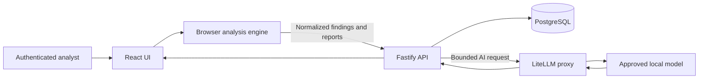

# MVA Unified V2 Repository Structure

This guide explains what each top-level folder and file in `unified-v2` does. It also identifies which paths are required at runtime, which paths support testing or evidence, and where administrators and developers should make common changes.

## 1. Repository Map

```text
unified-v2/
├── .github/                    GitHub automation
├── docs/                       Architecture, deployment, security, and handover guides
├── final/                      Approved generated report examples and release evidence
├── mva_engine/                 Legacy/supporting Python normalization utilities
├── output/                     Generated validation and development output
├── react-ui/                   React frontend and browser-side analysis engine
├── samples/                    Reproducible scanner and inventory test files
├── server/                     Fastify API, PostgreSQL access, authentication, and LiteLLM
├── ss/                         Visual evidence and complete manual test packs
├── tests/                      Supporting Python regression tests
├── tmp/                        Temporary local rendering and validation files
├── tools/                      Generation, validation, seeding, and integration scripts
├── .env.example               Local configuration template
├── .env.production.example    Production configuration template
├── .gitignore                 Files Git must not publish
├── compose.local.yml          Local Docker stack
├── compose.production.yml     Hardened production Docker stack
├── README.md                  Main project introduction and quick-start guide
├── requirements-validation.txt Python dependencies for validation utilities
├── run-postgres-local.sh      Start the local Docker stack
├── run-postgres-native.sh     Start the macOS native development stack
├── run-react-ui.sh            Start only the React development UI
├── SAMPLE_DATA.md             Sample-file instructions and expected behavior
├── stop-postgres-local.sh     Stop the local Docker stack
└── stop-postgres-native.sh    Stop the macOS native development stack
```

## 2. Production Runtime Folders

### `react-ui/`

The React and Tailwind CSS frontend. Scanner CSV/XLSX parsing, field normalization, dashboard calculations, charts, and local Excel/CSV/PDF generation primarily happen here.

| Path | Purpose |
|---|---|
| `src/App.jsx` | Main application shell, navigation, authenticated platform state, and workflow routing |
| `src/components/` | Screens and reusable UI components such as administration, uploads, dashboards, asset inventory, discovery coverage, threat intelligence, and LLM configuration |
| `src/lib/vulnerabilityEngine.js` | Scanner detection, field mapping, normalization, exploit interpretation, priority calculation, and monthly/quarterly comparison logic |
| `src/lib/reportExport.js` | Excel workbook and normalized report generation |
| `src/lib/pdfReport.js` | Standard remediation-guide PDF generation |
| `src/lib/executiveReportPdf.js` | Dashboard-oriented executive PDF generation |
| `src/lib/assetInventory.js` | Inventory CSV/XLSX and pasted-asset normalization |
| `src/lib/hostDiscovery.js` | Inventory-versus-discovery-versus-scan coverage calculations |
| `src/lib/databaseClient.js` | Authentication, tenants, assets, and persisted-report API calls |
| `src/lib/platformApi.js` | AI remediation and threat-intelligence API calls |
| `src/lib/*.test.js` | Frontend parser, calculation, export, and API-contract tests |
| `public/brand/` | Browser-served organization branding |
| `public/sample-data/` | Test packs available through the UI |
| `index.css` | Global cyber-security visual system and Tailwind layers |
| `nginx.local.conf` | Container web server, API reverse proxy, upload limits, timeouts, and security headers |
| `Dockerfile.local` | Builds the React application and serves it through Nginx |
| `package.json` | Frontend dependencies and `test`, `build`, and development commands |

`react-ui/node_modules/` and `react-ui/dist/` are generated locally. They are ignored by Git and must not be manually edited.

### `server/`

The Node.js Fastify backend. It enforces authentication, tenant isolation, roles, CSRF protection, database persistence, and server-side LiteLLM access.

| Path | Purpose |
|---|---|
| `src/server.js` | Process entry point; reads environment configuration, connects PostgreSQL, runs migrations, creates the LiteLLM client, and starts Fastify |
| `src/app.js` | Authenticated API routes for tenants, users, assets, findings, reports, threat intelligence, and AI remediation |
| `src/repository.js` | PostgreSQL queries, transactions, tenant filtering, asset synchronization, reports, and audit data |
| `src/auth.js` | Password hashing, sessions, role checks, cookies, CSRF, and sign-in throttling |
| `src/liteLlmClient.js` | Central OpenAI-compatible client for `/v1/models` and `/v1/chat/completions` through LiteLLM |
| `src/localLlm.js` | Previous/direct Ollama-compatible client retained for reference and contract tests; production startup currently uses `liteLlmClient.js` |
| `src/validation.js` | Server-side input validation and safe HTTP errors |
| `src/csv.js` | Safe CSV response generation and spreadsheet-formula neutralization |
| `migrations/` | Ordered PostgreSQL schema creation and upgrades |
| `test/` | API, authentication, authorization, security, LiteLLM, and legacy Ollama contract tests |
| `Dockerfile` | Production API container definition |
| `package.json` | Backend dependencies and commands |

All production AI calls are centralized through `server/src/liteLlmClient.js`. Provider keys are read from server environment variables and are never sent to React.

### `server/migrations/`

The authoritative database schema history. Fastify applies these migrations in numeric order before accepting traffic.

| Migration range | Responsibility |
|---|---|
| `001` | Initial schema |
| `002`-`006` | Multi-tenancy, asset scope, categories, memberships, and teams |
| `007`-`008` | Reporting dates and asset onboarding tool |
| `009`-`010` | Scanner evidence, threat intelligence, and asset identity |
| `011` | OpenShift workload evidence |

Never edit a migration that has already been applied in production. Add a new numbered migration for future schema changes.

## 3. Supporting Code And Automation

### `mva_engine/`

Supporting Python normalization and Tenable workbook logic developed before the browser engine became the main runtime implementation. It remains useful for regression comparison and command-line report tooling but is not loaded by the Dockerized React/Fastify application.

### `tools/`

Developer and release-engineering scripts. These generate sample data, workbooks, PDFs, screenshots, schema documents, and release manifests; seed test tenants; and validate PostgreSQL, threat intelligence, large datasets, and report integrity.

These scripts are not continuously running services. Use them only for controlled test, evidence, or release preparation.

### `tests/`

Python regression tests for supporting Python processing behavior. The primary production test suites are `react-ui/src/lib/*.test.js` and `server/test/*.test.js`.

### `.github/`

GitHub automation. `.github/workflows/ci.yml` installs frontend/backend dependencies, runs both JavaScript test suites, builds the production UI, and scans tracked files for provider secrets on every configured push or pull request.

## 4. Samples, Evidence, And Generated Files

### `samples/`

Small, reproducible test inputs organized by scanner:

- Tenable.sc and Tenable.io
- Qualys and Custom Qualys
- CrowdStrike
- OpenShift
- Universal custom parser
- Four tenant asset inventories

Use this folder for functional testing. Do not treat synthetic IPs, names, severities, or expected counts as customer data.

### `ss/sample data/`

The complete manual test pack. Each scanner folder contains asset inventory, host-discovery history, scan results, expected metrics, and a manifest. This is useful for end-to-end tenant, scan coverage, monthly comparison, and report testing.

### `final/`

Approved example deliverables and production-evidence artifacts, including generated Excel workbooks, executive PDFs, remediation PDFs, validation JSON, checksums, and a release manifest. These files demonstrate expected report quality; the running application does not read them.

### `ss/final-evidence/`

Rendered screenshots of the UI, PDF pages, and workbook sheets. This is visual QA evidence for reviewers and customer-facing report validation, not application runtime data.

### `output/`

Generated development and validation results. Only the curated files allowed by `.gitignore` are published. Most newly generated output remains local.

### `tmp/`

Disposable local working files created by LibreOffice, PDF rendering, screenshot generation, and workbook validation. The entire folder is ignored by Git and is not needed for deployment.

## 5. Root Configuration And Launch Files

| File | Purpose |
|---|---|
| `.env.example` | Local environment-variable placeholders; copy to `.env` and insert private local values |
| `.env.production.example` | Production placeholders for hostname, PostgreSQL secret path, LiteLLM URL/key/model, timeouts, cookies, and trusted proxies |
| `.gitignore` | Prevents secrets, dependencies, builds, dumps, temporary files, and unapproved generated output from entering Git |
| `compose.local.yml` | Local PostgreSQL, Fastify, and React/Nginx containers with development port bindings |
| `compose.production.yml` | Production PostgreSQL, Fastify, and frontend containers with health checks, secrets, read-only filesystems, persistent database volume, and private service networking |
| `requirements-validation.txt` | Python packages required only by report-generation and validation scripts |
| `README.md` | Product overview, supported sources, priority matrix, local run commands, tests, and deployment entry points |
| `SAMPLE_DATA.md` | File naming, sample locations, expected scenarios, and manual test guidance |

### Launcher scripts

| Script | Use |
|---|---|
| `run-postgres-local.sh` | Validates Docker, builds `compose.local.yml`, starts all containers, and waits for API health |
| `stop-postgres-local.sh` | Stops the local Compose stack |
| `run-postgres-native.sh` | Starts local PostgreSQL, Fastify, and React preview without Docker on macOS |
| `stop-postgres-native.sh` | Stops the native macOS processes |
| `run-react-ui.sh` | Runs only the React UI for frontend work; database-backed functionality still requires the API |

## 6. Runtime Data Flow



Raw scanner CSV/XLSX files are parsed in the browser. The browser sends normalized data to the authenticated API when a report is saved. Fastify enforces tenant access before reading or writing PostgreSQL. Only Fastify can access the LiteLLM key and model route.

## 7. What To Edit

| Change required | Primary location |
|---|---|
| Production URL, LiteLLM route, model alias, secrets, and proxy settings | `.env.production` created from `.env.production.example` |
| Local developer settings | `.env` created from `.env.example` |
| Scanner fields, exploit interpretation, priority calculations | `react-ui/src/lib/vulnerabilityEngine.js` |
| Excel structure and styling | `react-ui/src/lib/reportExport.js` |
| Standard remediation PDF | `react-ui/src/lib/pdfReport.js` |
| Executive dashboard PDF | `react-ui/src/lib/executiveReportPdf.js` |
| UI layout and screens | `react-ui/src/App.jsx` and `react-ui/src/components/` |
| Theme, typography, spacing, and colors | `react-ui/src/index.css` |
| API routes and authorization | `server/src/app.js` |
| Database queries and persistence | `server/src/repository.js` |
| Database schema | New file in `server/migrations/` |
| LiteLLM transport behavior | `server/src/liteLlmClient.js` |
| HTTPS hostname and TLS certificates | Organization reverse proxy outside this repository |

Do not hard-code passwords, PostgreSQL credentials, LiteLLM keys, model-provider keys, customer exports, or database dumps anywhere in the repository.

## 8. Minimum Production Checkout

The Docker deployment requires:

- `react-ui/`
- `server/`
- `compose.production.yml`
- `.env.production` created privately on the server
- `.secrets/postgres_password` created privately on the server

Keep `README.md`, `docs/`, and `.env.production.example` for operational support. The `samples/`, `final/`, `output/`, `ss/`, `tests/`, `mva_engine/`, and `tools/` folders are not required for normal runtime, but retaining them in a controlled engineering checkout supports acceptance testing, audit evidence, and future maintenance.
